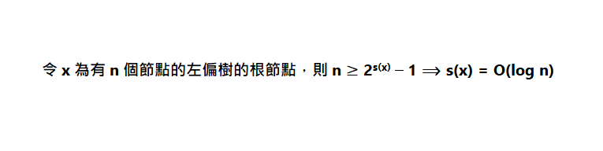

# 期末報告 — 左偏樹
---
## 介紹

### 定義
左偏樹是一種優先佇列的實現方式，屬於可並堆。左偏樹是一棵二元樹，每個節點有四個屬性：左子樹、右子樹、鍵值及距離，鍵值用於比較節點大小，而鍵值的定義如下：
>若且唯若節點 i 的左子樹或右子樹為空時，節點被稱作外節點。節點i的距離是節點 i 到它的後代中的最近的外節點所經過的邊數。如果節點 i 本身是外節點，則它的距離為0;而空節點的距離規定為 -1。

### 性質
- 節點的鍵值小於或等於它的左右子節點的鍵值。
- 節點的左子節點的距離不小於右子節點的距離。
- 節點的距離等於它的右子節點的距離加1。
- 一棵N個節點的左偏樹root節點的距離最多為log(N+1)-1。

### 支援的資料型別
- Insert(Q,x)：插入一個元素到 Q。
- Find-Min(Q)：從佇列 Q 裡頭取出最小元素。
- Delete-Min(Q)：從佇列 Q 裡頭移除最小元素。
- Merge(Q1,Q2)：合併兩個優先佇列 Q1 以及 Q2 。

## 實作

### 題目
有N個數字，初始情況，每個數字單獨構成一個集合，每次把X、Y所在集合的最大值除以2，然後合併X和Y所在集合，詢問新集合的最大值，若XY本身就在同一集合輸出-1。

### 程式

```
struct Lheap{
	int val,dis;
	Lheap *l,*r;
};
Lheap* tree[MAXN];
int fa[MAXN];
void init(Lheap* &t,int val){
	t=new Lheap;
	t->val=val;
	t->l=t->r=NULL;
	t->dis=0;
}
int findset(int x)
{
	int y,root,t;
	y=x;
	while(y!=fa[y])y=fa[y];
	root=y;
	y=x;
	while(fa[y]!=y){
		t=fa[y];
		fa[y]=root;
		y=t;
	}
	return root;
}
int Union(int x,int y){
	int fx=findset(x);
	int fy=findset(y);
	if(fx==fy)return -1;
	fa[fx]=fy;
	return fy;
}
int dis(Lheap *a){return (a)?(a->dis):(-1);}
Lheap* merge(Lheap* a,Lheap *b){
	if(a==NULL)return b;
	if(b==NULL)return a;
	if(b->val>a->val)swap(a,b);
	a->r=merge(a->r,b);
	if(dis(a->l)<dis(a->r))swap(a->l,a->r);
	a->dis=dis(a->r)+1;
	return a;
}
Lheap* delmax(Lheap *a){
	if(!a)return NULL;
	return merge(a->l,a->r);
}
int solve(int fx,int fy){
	Lheap *t1,*t2,*t3,*t4;
	init(t1,tree[fx]->val/2);
	t3=delmax(tree[fx]);
	t3=merge(t1,t3);
	init(t2,tree[fy]->val/2);
	t4=delmax(tree[fy]);
	t4=merge(t2,t4);
	fy=Union(fx,fy);
	tree[fy]=merge(t3,t4);
	return tree[fy]->val;
}
int main()
{
	int n;
	while(scanf("%d",&n)!=EOF){
		for(int i=1;i<=n;i++){
			int atk;
			scanf("%d",&atk);
			fa[i]=i;
			init(tree[i],atk);
		}
		int que;
		scanf("%d",&que);
		while(que--){
			int x,y;
			scanf("%d%d",&x,&y);
			int fx=findset(x),fy=findset(y);
			if(fx!=fy)printf("%d\n",solve(fx,fy));
			else printf("-1\n");
		}
		for(int i=1;i<=n;i++)delete tree[i];
	}
	return 0;
}
```

### 結果

#### 輸入

```
5
20
16
10
10
4
5
2 3
3 4
3 5
4 5
1 5
```

#### 輸出

```
8
5
5
-1
10
```

## 複雜度分析

每次合併時，因為沿著兩個要結合的左偏樹最右邊的路徑向下移動，根據引理可知路徑長度最多為對數等級，而每一層的操作為常數等級。假設兩棵樹的大小分別為 m 和 n ，那麼 Merge 的複雜度為 O(log m + log n)。
<br />
<br />
由此可知 Insert 和 Delete-Min 的複雜度也為 O(log n)。

### 引理



## 對左偏樹的比較

左偏樹可以實現二元堆積的一切功能，而且還能實現二元堆積不易實現的合併，但左偏樹的算法時間常數要大於二元堆積，所以不能完全代替之。
<br />
<br />
和平衡樹相比，左偏樹採取了與平衡樹完全相反的構造策略。平衡樹爲了實現所有元素的快速查找，使節點儘量趨於平衡。而左偏樹的目的是實現快速的查詢最小值與合併操作，恰恰要讓節點儘量向左偏。
**最優的平衡樹，恰恰是最差的左偏樹，而最優的左偏樹，恰恰是平衡樹退化的結果。**
<br />
<br />
斜堆積、二項式堆積、斐波那契堆積也是可並堆實現的有效方法，而且二項式堆積、斐波那契堆積實際中會比左偏樹更快，但是在時間與編程複雜度的性價比上，左偏樹有著絕對的優勢。

## 參考資料

[https://zh.wikipedia.org/wiki/%E5%B7%A6%E5%81%8F%E6%A0%91](https://zh.wikipedia.org/wiki/%E5%B7%A6%E5%81%8F%E6%A0%91)
<br />
[https://byvoid.com/zht/blog/leftist-tree/](https://byvoid.com/zht/blog/leftist-tree/)
<br />
[https://tmt514.gitbooks.io/2016-09/content/tree-ds/leftist-tree.html](https://tmt514.gitbooks.io/2016-09/content/tree-ds/leftist-tree.html)
<br />
[https://blog.csdn.net/nkwbtb/article/details/21938675](https://blog.csdn.net/nkwbtb/article/details/21938675)